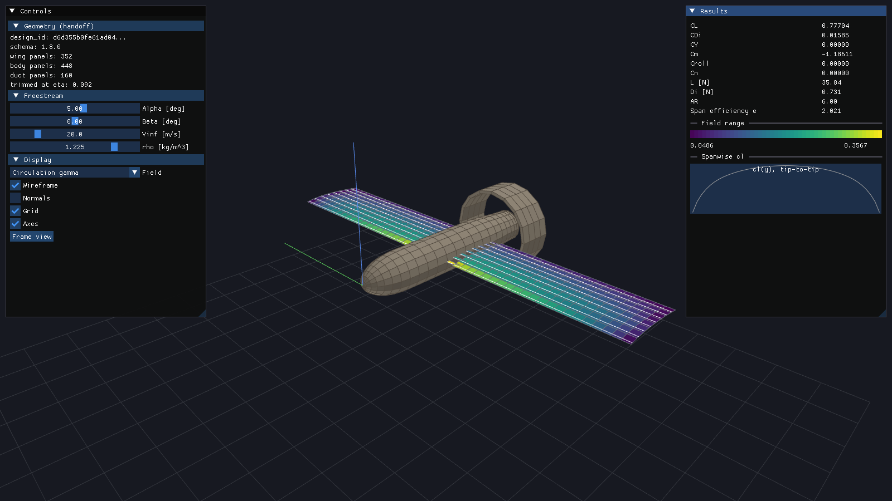

Theory and Method of Solution
================================

This page describes the numerical methods behind each module, and how they
compose into a single wing-body-propeller solve. Notation follows the
:doc:`intro` nomenclature table (``CL``, ``CDi``, ``Cm``, ``alphaDeg``,
``Vinf``, ``gamma``, ``rho``, ``Vec3.x/y/z``).

   ``aeolion_viewer`` rendering the coupled wing + fuselage + duct lattice
   built by ``PanelBuilder::LatticeBuilder`` from the real 1.8.0 geometry
   handoff fixture (``tests/Data/AeolionGeometryHandoff-1.8.0.json``): 352
   wing panels (colored by circulation :math:`\gamma`), 448 fuselage source
   panels (tan), and 160 duct source panels (tan, the ring aft of the
   fuselage) -- all one coupled potential-flow solve, at
   :math:`\alpha=5^\circ`. The duct is disjoint from the fuselage
   (``Geometry::DuctGeometry``, schema >= 1.8.0), paneled as two concentric
   cylinders capped front and back (``LatticeBuilder::BuildDuct()``), bore
   left open for the propeller/slipstream. The wing root leading edge is
   placed at the contract's stated anchor
   (``planform.placement.root_leading_edge``, schema >= 1.5.0), about 42%
   aft of the nose; the body's local radius there still trims
   :math:`\eta=0.092` of the wing root, restored by the carry-through
   vortex (``LatticeOptions::CarryThroughLift``) -- the same wing-body
   coupling ``tests/TestAirframe.cpp`` checks (see :doc:`tests`).

Discretization elements
---------------------------

Two singularity element types cover every surface in the model, and both
are **zeroth-order** (flat panel, uniform strength across the panel) --
accuracy comes from mesh density (chordwise/spanwise rows on the wing,
axial/circumferential rings on the body), not from a higher-order basis
within a single panel. Keeping every element constant-strength is also
what keeps the influence matrix a plain per-pair Biot-Savart or
solid-angle evaluation, linear in the unknown strengths.

**Horseshoe vortex** (``Lattice::Panel``) -- the lifting-surface element.
Built from one primitive, the straight vortex filament / finite Biot-Savart
segment (``Aeolion::Solver::SegmentVelocity``): given endpoints and
circulation :math:`\gamma`, it returns the induced velocity everywhere
except (regularized by a small viscous core) on its own line. A horseshoe
is three uses of that primitive at **equal** strength :math:`\Gamma`: a
leg from far downstream up to corner :math:`\mathbf{A}`, the bound segment
:math:`\mathbf{A}\to\mathbf{B}` on the panel's quarter-chord, and a leg
from :math:`\mathbf{B}` back out downstream. Equal strength along all
three is not a modeling choice -- it is Helmholtz's vortex theorem: a
vortex filament's strength is constant along its length and a vortex line
cannot end in the fluid, so the bound segment's circulation has to be
carried away by trailing legs rather than terminating at the panel edges.
Those legs are cut off at a finite ``trailLength`` (``DefaultTrailSpanFactor``
= 50x span by default) rather than truly extending to infinity -- far
enough that a near-field point cannot tell the difference, since the
Biot-Savart contribution falls off with distance.

A constant-strength horseshoe vortex is aerodynamically equivalent to a
constant-strength doublet panel bounded by the same edges (a classical
VLM/panel-method identity, Katz & Plotkin ch. 10 :cite:`katzPlotkin2001`).
Aeolion states the circulation form directly rather than routing through a
doublet formulation, since a horseshoe glues naturally onto a wake built
from more of the same filament primitive -- there is no separate "wake
element" type, just more instances of ``SegmentVelocity``.

**Source panel** (``Lattice::SourcePanel``) -- the non-lifting-body
element. A flat, constant-strength quadrilateral distribution of sources:
no bound circulation, no shed wake. This is deliberate, not merely
simpler: a fuselage is a closed, simply-connected, non-lifting volume, and
its Neumann (no-penetration) condition is solvable by a source/sink
distribution alone -- zero net force on the closed body falls out
automatically (d'Alembert's paradox) rather than needing to be imposed.
Introducing vortices there instead would inject circulation the geometry
has no physical mechanism to shed, which is exactly the trap
``Lattice/SourcePanel.h`` warns against.

.. list-table:: Element types at a glance
   :header-rows: 1
   :widths: 20 30 30 20

   * - Element
     - Singularity / kernel
     - Governs
     - Type
   * - Horseshoe vortex
     - Bound + 2 trailing vortex filaments, Biot-Savart, constant :math:`\Gamma`
     - Lifting surfaces (wing): circulation, lift, induced drag
     - ``Lattice::Panel``
   * - Source panel
     - Flat quadrilateral, constant :math:`\sigma`, solid-angle normal kernel
     - Non-lifting bodies (fuselage): thickness/blockage, Munk moment
     - ``Lattice::SourcePanel``

Both element types are, geometrically, flat quads -- the wing's true
camber curvature is captured by *where* each flat panel is placed (its
corners sit on the local camber-surface point, see
:ref:`camber-surface-controls`), not by curving the panel or its
singularity distribution.

Vortex lattice method (Aeolion::Solver)
------------------------------------------

Each spanwise panel is represented by one **horseshoe vortex**: a bound
segment on the panel's local quarter-chord line, with two trailing legs
running downstream from its endpoints. The control point, where flow
tangency is enforced, sits on the local three-quarter-chord line -- the
classic Katz & Plotkin VLM1 collocation rule :cite:`katzPlotkin2001`. The
wake is **frozen**: trailing legs run parallel to the global x-axis rather
than relaxing to the local streamline, the standard small-to-moderate
angle-of-attack simplification.

**Induced velocity.** Every vortex filament's contribution is the
Biot-Savart law for a straight segment of circulation :math:`\gamma`
running :math:`P_1 \to P_2`:

.. math::

   \mathbf{V}(\mathbf{P}) = \frac{\gamma}{4\pi} \frac{\mathbf{r}_1 \times \mathbf{r}_2}
       {|\mathbf{r}_1 \times \mathbf{r}_2|^2}
       \left( \mathbf{r}_0 \cdot \hat{\mathbf{r}}_1 - \mathbf{r}_0 \cdot \hat{\mathbf{r}}_2 \right)

with :math:`\mathbf{r}_1 = \mathbf{P}-\mathbf{P}_1`,
:math:`\mathbf{r}_2 = \mathbf{P}-\mathbf{P}_2`,
:math:`\mathbf{r}_0 = \mathbf{P}_2-\mathbf{P}_1`. A small viscous-core
cutoff regularizes the singularity directly on a filament
(``Aeolion::Solver::SegmentVelocity``).

**Boundary condition and linear solve.** Every unknown is a singularity
strength (vortex circulation :math:`\Gamma_j` on a lifting panel, or
source strength :math:`\sigma_j` on a body panel) and every equation is
flow tangency at one control point. Stacking :math:`N` vortex unknowns
then :math:`M` source unknowns into one vector :math:`\mathbf{x} =
[\Gamma_1 \ldots \Gamma_N,\ \sigma_1 \ldots \sigma_M]^\top`, the system is
a single dense :math:`(N+M)\times(N+M)` matrix equation

.. math::

   \begin{bmatrix} A_{vv} & A_{vs} \\ A_{sv} & A_{ss} \end{bmatrix}
   \begin{bmatrix} \Gamma \\ \sigma \end{bmatrix}
   =
   \begin{bmatrix} w_v - \mathbf{V}_{kin} \cdot \hat{\mathbf{n}}_v \\
                   w_s - \mathbf{V}_{kin} \cdot \hat{\mathbf{n}}_s \end{bmatrix}

where :math:`A_{xy}` is the normal velocity induced at an :math:`x`
control point by unit strength on a :math:`y` element, and :math:`w` is
the boundary condition's prescribed normal velocity -- zero for a solid
wall, nonzero only where a panel transpires (a duct base carrying
propeller efflux). A wing-only case simply has an empty source block; the
blocking is emergent from panel indexing, not a separate code path
(``Aeolion::Solver::PanelSystem``).

Element-by-element, row :math:`i` (control point :math:`\mathbf{c}_i`,
outward normal :math:`\hat{\mathbf{n}}_i`) against column :math:`j` reads

.. math::

   A_{ij} =
   \begin{cases}
     \hat{\mathbf{n}}_i \cdot \mathbf{V}_{\Gamma=1}(\mathbf{c}_i;\ \text{horseshoe } j) & j \text{ a vortex panel} \\
     \hat{\mathbf{n}}_i \cdot \mathbf{V}_{\sigma=1}(\mathbf{c}_i;\ \text{source panel } j) & j \text{ a source panel}, i \ne j \\
     \tfrac{1}{2} & j \text{ a source panel}, i = j
   \end{cases}

with :math:`\mathbf{V}_{\Gamma=1}` the Biot-Savart horseshoe kernel above
and :math:`\mathbf{V}_{\sigma=1}` the source-panel kernel below, both
evaluated at unit strength (``Aeolion::Solver::PanelSystem::
NormalInfluence``). A source panel's own control point sits exactly on
its sheet, where the induced velocity is indeterminate; the diagonal is
the analytic source-sheet jump :math:`\pm\tfrac{1}{2}` instead
(``SourceSelfInfluence``). A vortex panel's own diagonal entry needs no
such special case -- its control point (three-quarter-chord) never lies on
its own bound segment (quarter-chord), so the kernel is regular there.

The right-hand side is what the freestream and body motion already supply,
subtracted from the prescribed condition:

.. math::

   \mathbf{V}_{kin}(\mathbf{p}) = \mathbf{V}_\infty - \boldsymbol{\omega} \times (\mathbf{p} - \mathbf{p}_{ref}) + \mathbf{V}_{ext}(\mathbf{p}), \qquad
   \mathbf{V}_\infty = V_\infty
   \begin{bmatrix} \cos\alpha\cos\beta \\ \sin\beta \\ \sin\alpha\cos\beta \end{bmatrix}

with :math:`\boldsymbol{\omega} = (p, q, r)` the body rates about
``FreestreamConditions::RefPoint`` and :math:`\mathbf{V}_{ext}` an
optional external perturbation field (e.g. a propeller slipstream model,
passed as ``Solve()``'s ``externalField`` callback). :math:`w_i` is zero
for every solid panel and nonzero only on a transpiring base
(``SourcePanel::PrescribedNormalVelocity``).

The matrix is dense and depends only on geometry, so it is factorized once
via LAPACK's ``dgetrf`` (partial-pivoting LU) and re-solved with
``dgetrs`` against as many right-hand sides (flight conditions) as needed
(``Aeolion::Solver::Prepare`` / ``SolveWithSystem``) -- the pattern
:cpp:func:`Aeolion::Solver::ComputeDerivatives` uses for its 11-point
central-difference stability sweep.

**Force and moment integration.** Computed by the **near-field method**,
not a Trefftz-plane integration. At each vortex panel's bound-vortex
midpoint :math:`\mathbf{m}_i = \tfrac{1}{2}(\mathbf{A}_i+\mathbf{B}_i)`,
sum the velocity induced by every *other* singularity (vortices with their
bound segment included, sources) plus :math:`\mathbf{V}_{kin}(\mathbf{m}_i)`
-- the panel's own bound segment is excluded here (it is singular at its
own midpoint), unlike the boundary-condition matrix above, which needs no
such exclusion because control point and bound segment never coincide.
Kutta-Joukowski then gives that panel's force directly:

.. math::

   \mathbf{F}_i = \rho\,\Gamma_i\,\bigl(\mathbf{V}_i^{local} \times d\boldsymbol{\ell}_i\bigr),
   \qquad d\boldsymbol{\ell}_i = \mathbf{B}_i - \mathbf{A}_i.

A source panel carries no bound circulation, so Kutta-Joukowski says
nothing about it; its force is the pressure integral over its face
instead, from the local-speed form of Bernoulli's equation:

.. math::

   C_{p,k} = 1 - \left(\frac{|\mathbf{V}_k^{local}|}{V_\infty}\right)^2, \qquad
   \mathbf{F}_k = -C_{p,k}\, q_\infty\, A_k\, \hat{\mathbf{n}}_k,
   \qquad q_\infty = \tfrac{1}{2}\rho V_\infty^2,

skipped for a permeable (transpiring) panel, which has no wall for
pressure to act on. Total force and moment about the reference point are
the sums :math:`\mathbf{F} = \sum_i \mathbf{F}_i + \sum_k \mathbf{F}_k`
and :math:`\mathbf{M} = \sum_i (\mathbf{m}_i-\mathbf{p}_{ref})\times\mathbf{F}_i
+ \sum_k (\mathbf{c}_k-\mathbf{p}_{ref})\times\mathbf{F}_k`.

**Wind axes and coefficients.** Force resolves onto a wind-axis triad
built from the *translational* freestream only (not the rotation terms):

.. math::

   \hat{\mathbf{d}} = \hat{\mathbf{V}}_\infty, \qquad
   \hat{\mathbf{l}} = \widehat{\hat{\mathbf{d}} \times \hat{\mathbf{y}}}, \qquad
   \hat{\mathbf{s}} = \hat{\mathbf{l}} \times \hat{\mathbf{d}},

giving :math:`L=\mathbf{F}\cdot\hat{\mathbf{l}}`,
:math:`D_i=\mathbf{F}\cdot\hat{\mathbf{d}}`,
:math:`Y=\mathbf{F}\cdot\hat{\mathbf{s}}`, with
:math:`(M_x,M_y,M_z)=\mathbf{M}` directly in body axes (x aft, y right, z
up: positive :math:`M_x` right-wing-up roll, positive :math:`M_y` nose-up
pitch, positive :math:`M_z` nose-right yaw). Coefficients are then

.. math::

   C_L = \frac{L}{q_\infty S}, \quad
   C_{Di} = \frac{D_i}{q_\infty S}, \quad
   C_Y = \frac{Y}{q_\infty S}, \quad
   C_{roll} = \frac{M_x}{q_\infty S b}, \quad
   C_m = \frac{M_y}{q_\infty S \bar{c}}, \quad
   C_n = \frac{M_z}{q_\infty S b},

normalized by **planform area** :math:`S` (the reference-area convention;
the projection onto the reference plane, not the panel's true wetted
area -- see ``Aeolion::Lattice::Panel`` for why the two must not be
confused), reference chord :math:`\bar{c}`, and reference span :math:`b`
(``Aeolion::Solver::ReferenceGeometry``; :math:`S` defaults to the summed
panel planform area, :math:`\bar{c} = S/b` unless overridden). A
spanwise station's local (sectional) lift coefficient normalizes its
lift-per-span by the same freestream :math:`q_\infty` and its own section
chord: :math:`c_{l,local} = (dL/dy) / (q_\infty\, c_{section})`.

.. _camber-surface-controls:

Camber surface and control surfaces (Aeolion::PanelBuilder)
----------------------------------------------------------------

``Aeolion::PanelBuilder::LatticeBuilder`` turns a parsed
:cpp:class:`Aeolion::Geometry::HandoffContract` into the solver's lattice,
placing every lattice point on the **mean camber line** of the local CST
(Class-Shape Transformation) section rather than a flat reference plane:

.. math::

   y(\psi) = \psi^{N_1}(1-\psi)^{N_2} \sum_i A_i B_{i,n}(\psi), \qquad
   \text{camber}(\psi) = \frac{y_{upper}(\psi) + y_{lower}(\psi)}{2}

with :math:`\psi = x/c`, :math:`B_{i,n}` the Bernstein basis, and class
exponents fixed at :math:`N_1=0.5,\ N_2=1.0` (round leading edge, sharp
trailing edge). The panel's flow-tangency normal comes from the camber
**slope** at its own three-quarter-chord point, so a cambered section
develops lift at zero geometric incidence -- the effect a flat lattice
structurally cannot represent.

The quarter-chord line is accumulated outward from the root using each
sub-interval's midpoint sweep/dihedral angle (exact when the angle is
piecewise-constant across a station segment, convergent otherwise), and
the mesh is forced to land on breakpoints -- every planform station and
every control-surface eta edge spanwise; the hinge line chordwise -- so a
control surface's extent and deflection are properties of the contract,
not artifacts of panel placement. A deflected control surface is a rigid
rotation of its panels (geometry and normal) about the hinge axis, which
preserves camber-line arc length.

Fuselage source panels (Aeolion::Solver / Lattice::SourcePanel)
----------------------------------------------------------------------

The fuselage is a closed, non-lifting body, panelled with **constant-
strength quadrilateral source panels** rather than horseshoe vortices: a
source distribution enforces "no flow through the surface" without
introducing bound circulation or a shed wake. Sources produce no net force
on a closed body (d'Alembert's paradox, the correct potential-flow
answer), but they do produce the surface pressure distribution and hence
the body's pitching moment at incidence -- the **Munk moment**, the
dominant destabilizing contribution a fuselage makes to airframe
stability -- and the upwash the wing sees.

In-plane induced velocity follows the classical Hess & Smith flat-panel
result: transform into a local frame where the panel lies in :math:`z=0`
and sum a logarithm per edge :cite:`katzPlotkin2001`. The **normal**
component is the signed solid angle the panel subtends at the field
point, evaluated per triangle by the Van Oosterom & Strackee formula --
singularity-free, unlike the textbook per-edge arctangent form, which
blows up for any edge parallel to a local axis (a case that arises
constantly on a body of revolution).

An open base (duct exit) is not a solid wall: it carries a **prescribed
transpiration velocity** equal to the propeller's exit speed along the
outward normal, so the propulsive jet reshapes the field around the rest
of the body without being counted as a pressure force on a face that
physically is not there (``Aeolion::PanelBuilder::ApplyBaseEfflux``).

Propeller: rotating-frame vortex lattice
----------------------------------------

Aeolion's propeller method is its own solver applied in a rotating
frame -- a panel method, consistent with the rest of the toolkit. (The
blade-element momentum theory solver that used to live here moved to its
own repository, `onurtuncer/BEMT <https://github.com/onurtuncer/BEMT>`_,
which this toolkit does not depend on.)

``PanelBuilder::BuildPropellerLattice`` meshes each blade of a
``Geometry::Propeller`` into the same horseshoe-vortex panels the wing
uses: chordwise rows by radial strips, flat plates on the chord line at
the local geometric twist, swept out per blade azimuth about +x. The
rotation is not special-cased anywhere in the solver: it enters as the
body roll rate :math:`p = \Omega` in ``FreestreamConditions``, whose
kinematic-velocity term
:math:`\mathbf{V}_{kin} = \mathbf{V}_\infty - \boldsymbol{\omega} \times
\mathbf{r}` hands every blade panel its true :math:`\Omega r` tangential
onset flow, and the near-field Kutta-Joukowski force evaluation uses that
same local velocity, so the body-axis sums are dimensional propeller
loads directly: thrust :math:`= -F_x` (upstream), shaft torque
:math:`= -M_x` (opposing :math:`+\Omega`), power :math:`= Q\,\Omega`.

Each trailing leg leaves along the **local relative wind** at its root
(axial inflow plus the tangential sweep) -- the linearized helix. This is
load-bearing, not cosmetic: at hover the local wind is almost purely
tangential, and trailing the wake axially instead leaves the legs
near-perpendicular to the flow, destroying the quarter/three-quarter
chord lattice geometry (the circulation solve saw-tooths radially and
diverges under refinement).

Limitations, stated plainly: quasi-steady with a rigid straight-line
wake -- no helical curvature, roll-up, or contraction, so heavily-loaded
static (hover) thrust reads optimistic; torque and power are induced
only (potential flow carries no profile drag); blades are flat plates
(the contract's CST blade sections are not yet folded in as camber); and
there is no stall. ``TestPropellerLattice`` pins the physics that must
hold regardless: thrust upstream, torque opposing rotation, exact
blade-symmetry force cancellation, and thrust falling with advance speed
at fixed rpm.

Viscous drag buildup (Aeolion::DragEstimate)
-------------------------------------------------

Vortex lattice methods are potential-flow (inviscid), so
``Solver::SolveResult::CDi`` is **induced drag only**. Total drag needs a
separate viscous ("profile"/"parasite") estimate via the classic
component buildup method (Raymer; Hoerner :cite:`hoerner1965fluiddynamicdrag`):

.. math::

   C_{D0} = \frac{1}{S_{ref}} \sum_c C_{f,c}\, FF_c\, Q_c\, S_{wet,c}
            \; \times \; (1 + f_{misc})

with, per wetted component :math:`c`: :math:`C_f` a flat-plate skin
friction coefficient (Blasius laminar, Prandtl-Schlichting turbulent with
an optional Frankl-Voishel compressibility correction, or an engineering
laminar/turbulent blend); :math:`FF` a form factor from thickness ratio +
sweep (airfoil-like components) or fineness ratio (body-like components);
:math:`Q` an interference factor for junctions with the rest of the
airframe; and :math:`f_{misc}` a lumped excrescence allowance. This is a
mid-fidelity, conceptual-design-level estimate (typical accuracy
:math:`\pm 10\text{-}20\%` for a clean configuration), not a substitute
for wind-tunnel or CFD data.

Total drag is then ``CD_total = CDi (Aeolion::Solver::Solve) + CD0
(Aeolion::DragEstimate::EstimateCD0)``.

Stability derivatives
--------------------------

``Aeolion::Solver::ComputeDerivatives`` builds a central-difference table
of stability & control derivatives about a baseline flight condition:
angular derivatives (``CL_alpha``, ``CY_beta``, ...) per radian, rate
derivatives both dimensionally (:math:`d(\text{coefficient})/d(\text{rate
in rad/s})`) and in the conventional nondimensional form (e.g. ``Cm_q_nd``
:math:`= dCm / d(q\,\bar{c}/(2 V_\infty))`), suitable for a 6-DOF
simulation or a derivative-table export. The geometry is factorized once
and reused across all eleven perturbed solves (:math:`\pm\alpha, \pm\beta,
\pm p, \pm q, \pm r`), rather than re-factorizing the influence matrix
from scratch each time.

References
----------

.. bibliography::
   :all:
