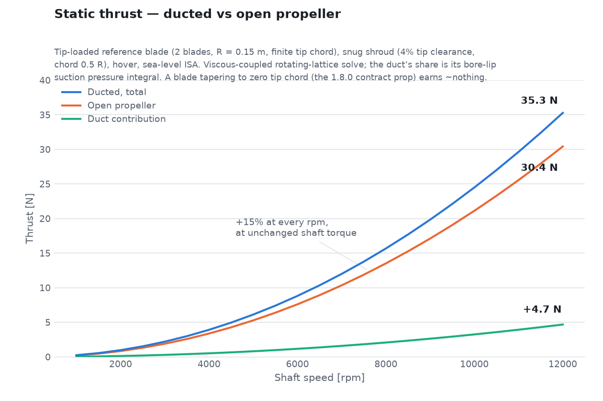
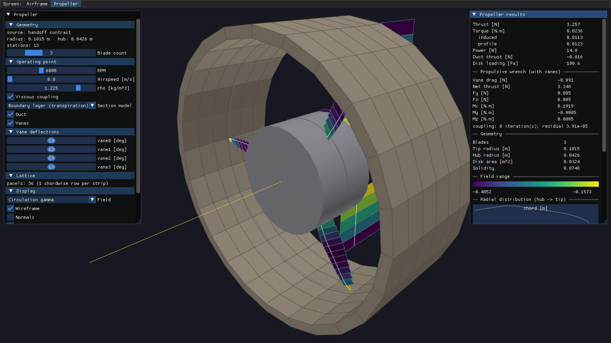
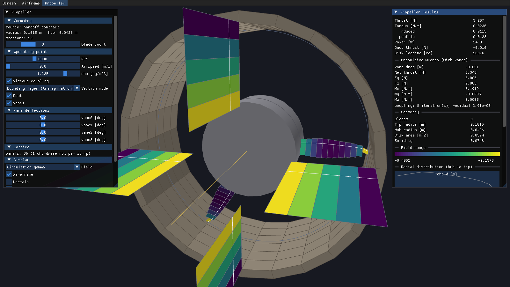
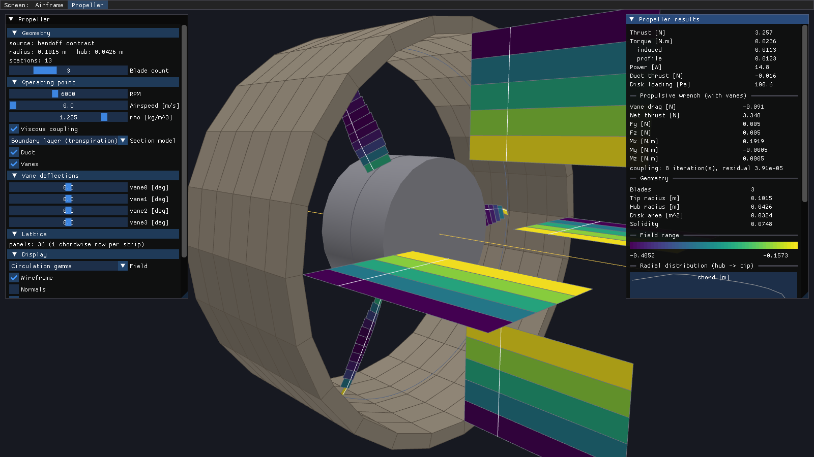

Theory and Method of Solution
================================

This page describes the numerical methods behind each module, and how they
compose into a single wing-body-propeller solve. Notation follows the
:doc:`intro` nomenclature table (``CL``, ``CDi``, ``Cm``, ``alphaDeg``,
``Vinf``, ``gamma``, ``rho``, ``Vec3.x/y/z``).

.. figure:: _static/viewer_airframe.png
   :alt: aeolion_viewer rendering of the wing, fuselage, and duct lattice for a real geometry handoff
   :width: 100%

   ``aeolion_viewer`` rendering the coupled wing + fuselage + duct lattice
   built by ``PanelBuilder::LatticeBuilder`` from the real 1.8.0 geometry
   handoff fixture (``tests/Data/AeolionGeometryHandoff-1.8.0.json``): 352
   wing panels (colored by circulation :math:`\gamma`), 448 fuselage source
   panels (tan), and 160 duct source panels (tan, the ring aft of the
   fuselage) -- all one coupled potential-flow solve, at
   :math:`\alpha=5^\circ`. The duct is disjoint from the fuselage
   (``Geometry::DuctGeometry``, schema >= 1.8.0), paneled as two concentric
   cylinders capped front and back (``LatticeBuilder::BuildDuct()``), bore
   left open for the propeller/slipstream. The wing root leading edge is
   placed at the contract's stated anchor
   (``planform.placement.root_leading_edge``, schema >= 1.5.0), about 42%
   aft of the nose; the body's local radius there still trims
   :math:`\eta=0.092` of the wing root, restored by the carry-through
   vortex (``LatticeOptions::CarryThroughLift``) -- the same wing-body
   coupling ``tests/TestAirframe.cpp`` checks (see :doc:`tests`).

Discretization elements
---------------------------

Two singularity element types cover every surface in the model, and both
are **zeroth-order** (flat panel, uniform strength across the panel) --
accuracy comes from mesh density (chordwise/spanwise rows on the wing,
axial/circumferential rings on the body), not from a higher-order basis
within a single panel. Keeping every element constant-strength is also
what keeps the influence matrix a plain per-pair Biot-Savart or
solid-angle evaluation, linear in the unknown strengths.

**Horseshoe vortex** (``Lattice::Panel``) -- the lifting-surface element.
Built from one primitive, the straight vortex filament / finite Biot-Savart
segment (``Aeolion::Solver::SegmentVelocity``): given endpoints and
circulation :math:`\gamma`, it returns the induced velocity everywhere
except (regularized by a small viscous core) on its own line. A horseshoe
is three uses of that primitive at **equal** strength :math:`\Gamma`: a
leg from far downstream up to corner :math:`\mathbf{A}`, the bound segment
:math:`\mathbf{A}\to\mathbf{B}` on the panel's quarter-chord, and a leg
from :math:`\mathbf{B}` back out downstream. Equal strength along all
three is not a modeling choice -- it is Helmholtz's vortex theorem: a
vortex filament's strength is constant along its length and a vortex line
cannot end in the fluid, so the bound segment's circulation has to be
carried away by trailing legs rather than terminating at the panel edges.
Those legs are cut off at a finite ``trailLength`` (``DefaultTrailSpanFactor``
= 50x span by default) rather than truly extending to infinity -- far
enough that a near-field point cannot tell the difference, since the
Biot-Savart contribution falls off with distance.

A constant-strength horseshoe vortex is aerodynamically equivalent to a
constant-strength doublet panel bounded by the same edges (a classical
VLM/panel-method identity, Katz & Plotkin ch. 10 :cite:`katzPlotkin2001`).
Aeolion states the circulation form directly rather than routing through a
doublet formulation, since a horseshoe glues naturally onto a wake built
from more of the same filament primitive -- there is no separate "wake
element" type, just more instances of ``SegmentVelocity``.

**Source panel** (``Lattice::SourcePanel``) -- the non-lifting-body
element. A flat, constant-strength quadrilateral distribution of sources:
no bound circulation, no shed wake. This is deliberate, not merely
simpler: a fuselage is a closed, simply-connected, non-lifting volume, and
its Neumann (no-penetration) condition is solvable by a source/sink
distribution alone -- zero net force on the closed body falls out
automatically (d'Alembert's paradox) rather than needing to be imposed.
Introducing vortices there instead would inject circulation the geometry
has no physical mechanism to shed, which is exactly the trap
``Lattice/SourcePanel.h`` warns against.

.. list-table:: Element types at a glance
   :header-rows: 1
   :widths: 20 30 30 20

   * - Element
     - Singularity / kernel
     - Governs
     - Type
   * - Horseshoe vortex
     - Bound + 2 trailing vortex filaments, Biot-Savart, constant :math:`\Gamma`
     - Lifting surfaces (wing): circulation, lift, induced drag
     - ``Lattice::Panel``
   * - Source panel
     - Flat quadrilateral, constant :math:`\sigma`, solid-angle normal kernel
     - Non-lifting bodies (fuselage): thickness/blockage, Munk moment
     - ``Lattice::SourcePanel``

Both element types are, geometrically, flat quads -- the wing's true
camber curvature is captured by *where* each flat panel is placed (its
corners sit on the local camber-surface point, see
:ref:`camber-surface-controls`), not by curving the panel or its
singularity distribution.

Vortex lattice method (Aeolion::Solver)
------------------------------------------

Each spanwise panel is represented by one **horseshoe vortex**: a bound
segment on the panel's local quarter-chord line, with two trailing legs
running downstream from its endpoints. The control point, where flow
tangency is enforced, sits on the local three-quarter-chord line -- the
classic Katz & Plotkin VLM1 collocation rule :cite:`katzPlotkin2001`. The
wake is **frozen**: trailing legs run parallel to the global x-axis rather
than relaxing to the local streamline, the standard small-to-moderate
angle-of-attack simplification.

**Induced velocity.** Every vortex filament's contribution is the
Biot-Savart law for a straight segment of circulation :math:`\gamma`
running :math:`P_1 \to P_2`:

.. math::

   \mathbf{V}(\mathbf{P}) = \frac{\gamma}{4\pi} \frac{\mathbf{r}_1 \times \mathbf{r}_2}
       {|\mathbf{r}_1 \times \mathbf{r}_2|^2}
       \left( \mathbf{r}_0 \cdot \hat{\mathbf{r}}_1 - \mathbf{r}_0 \cdot \hat{\mathbf{r}}_2 \right)

with :math:`\mathbf{r}_1 = \mathbf{P}-\mathbf{P}_1`,
:math:`\mathbf{r}_2 = \mathbf{P}-\mathbf{P}_2`,
:math:`\mathbf{r}_0 = \mathbf{P}_2-\mathbf{P}_1`. A small viscous-core
cutoff regularizes the singularity directly on a filament
(``Aeolion::Solver::SegmentVelocity``).

**Boundary condition and linear solve.** Every unknown is a singularity
strength (vortex circulation :math:`\Gamma_j` on a lifting panel, or
source strength :math:`\sigma_j` on a body panel) and every equation is
flow tangency at one control point. Stacking :math:`N` vortex unknowns
then :math:`M` source unknowns into one vector :math:`\mathbf{x} =
[\Gamma_1 \ldots \Gamma_N,\ \sigma_1 \ldots \sigma_M]^\top`, the system is
a single dense :math:`(N+M)\times(N+M)` matrix equation

.. math::

   \begin{bmatrix} A_{vv} & A_{vs} \\ A_{sv} & A_{ss} \end{bmatrix}
   \begin{bmatrix} \Gamma \\ \sigma \end{bmatrix}
   =
   \begin{bmatrix} w_v - \mathbf{V}_{kin} \cdot \hat{\mathbf{n}}_v \\
                   w_s - \mathbf{V}_{kin} \cdot \hat{\mathbf{n}}_s \end{bmatrix}

where :math:`A_{xy}` is the normal velocity induced at an :math:`x`
control point by unit strength on a :math:`y` element, and :math:`w` is
the boundary condition's prescribed normal velocity -- zero for a solid
wall, nonzero only where a panel transpires (a duct base carrying
propeller efflux). A wing-only case simply has an empty source block; the
blocking is emergent from panel indexing, not a separate code path
(``Aeolion::Solver::PanelSystem``).

Element-by-element, row :math:`i` (control point :math:`\mathbf{c}_i`,
outward normal :math:`\hat{\mathbf{n}}_i`) against column :math:`j` reads

.. math::

   A_{ij} =
   \begin{cases}
     \hat{\mathbf{n}}_i \cdot \mathbf{V}_{\Gamma=1}(\mathbf{c}_i;\ \text{horseshoe } j) & j \text{ a vortex panel} \\
     \hat{\mathbf{n}}_i \cdot \mathbf{V}_{\sigma=1}(\mathbf{c}_i;\ \text{source panel } j) & j \text{ a source panel}, i \ne j \\
     \tfrac{1}{2} & j \text{ a source panel}, i = j
   \end{cases}

with :math:`\mathbf{V}_{\Gamma=1}` the Biot-Savart horseshoe kernel above
and :math:`\mathbf{V}_{\sigma=1}` the source-panel kernel below, both
evaluated at unit strength (``Aeolion::Solver::PanelSystem::
NormalInfluence``). A source panel's own control point sits exactly on
its sheet, where the induced velocity is indeterminate; the diagonal is
the analytic source-sheet jump :math:`\pm\tfrac{1}{2}` instead
(``SourceSelfInfluence``). A vortex panel's own diagonal entry needs no
such special case -- its control point (three-quarter-chord) never lies on
its own bound segment (quarter-chord), so the kernel is regular there.

The right-hand side is what the freestream and body motion already supply,
subtracted from the prescribed condition:

.. math::

   \mathbf{V}_{kin}(\mathbf{p}) = \mathbf{V}_\infty - \boldsymbol{\omega} \times (\mathbf{p} - \mathbf{p}_{ref}) + \mathbf{V}_{ext}(\mathbf{p}), \qquad
   \mathbf{V}_\infty = V_\infty
   \begin{bmatrix} \cos\alpha\cos\beta \\ \sin\beta \\ \sin\alpha\cos\beta \end{bmatrix}

with :math:`\boldsymbol{\omega} = (p, q, r)` the body rates about
``FreestreamConditions::RefPoint`` and :math:`\mathbf{V}_{ext}` an
optional external perturbation field (e.g. a propeller slipstream model,
passed as ``Solve()``'s ``externalField`` callback). :math:`w_i` is zero
for every solid panel and nonzero only on a transpiring base
(``SourcePanel::PrescribedNormalVelocity``).

The matrix is dense and depends only on geometry, so it is factorized once
via LAPACK's ``dgetrf`` (partial-pivoting LU) and re-solved with
``dgetrs`` against as many right-hand sides (flight conditions) as needed
(``Aeolion::Solver::Prepare`` / ``SolveWithSystem``) -- the pattern
:cpp:func:`Aeolion::Solver::ComputeDerivatives` uses for its 11-point
central-difference stability sweep.

**Force and moment integration.** Computed by the **near-field method**,
not a Trefftz-plane integration. At each vortex panel's bound-vortex
midpoint :math:`\mathbf{m}_i = \tfrac{1}{2}(\mathbf{A}_i+\mathbf{B}_i)`,
sum the velocity induced by every *other* singularity (vortices with their
bound segment included, sources) plus :math:`\mathbf{V}_{kin}(\mathbf{m}_i)`
-- the panel's own bound segment is excluded here (it is singular at its
own midpoint), unlike the boundary-condition matrix above, which needs no
such exclusion because control point and bound segment never coincide.
Kutta-Joukowski then gives that panel's force directly:

.. math::

   \mathbf{F}_i = \rho\,\Gamma_i\,\bigl(\mathbf{V}_i^{local} \times d\boldsymbol{\ell}_i\bigr),
   \qquad d\boldsymbol{\ell}_i = \mathbf{B}_i - \mathbf{A}_i.

A source panel carries no bound circulation, so Kutta-Joukowski says
nothing about it; its force is the pressure integral over its face
instead, from the local-speed form of Bernoulli's equation:

.. math::

   C_{p,k} = 1 - \left(\frac{|\mathbf{V}_k^{local}|}{V_\infty}\right)^2, \qquad
   \mathbf{F}_k = -C_{p,k}\, q_\infty\, A_k\, \hat{\mathbf{n}}_k,
   \qquad q_\infty = \tfrac{1}{2}\rho V_\infty^2,

skipped for a permeable (transpiring) panel, which has no wall for
pressure to act on. Total force and moment about the reference point are
the sums :math:`\mathbf{F} = \sum_i \mathbf{F}_i + \sum_k \mathbf{F}_k`
and :math:`\mathbf{M} = \sum_i (\mathbf{m}_i-\mathbf{p}_{ref})\times\mathbf{F}_i
+ \sum_k (\mathbf{c}_k-\mathbf{p}_{ref})\times\mathbf{F}_k`.

**Wind axes and coefficients.** Force resolves onto a wind-axis triad
built from the *translational* freestream only (not the rotation terms):

.. math::

   \hat{\mathbf{d}} = \hat{\mathbf{V}}_\infty, \qquad
   \hat{\mathbf{l}} = \widehat{\hat{\mathbf{d}} \times \hat{\mathbf{y}}}, \qquad
   \hat{\mathbf{s}} = \hat{\mathbf{l}} \times \hat{\mathbf{d}},

giving :math:`L=\mathbf{F}\cdot\hat{\mathbf{l}}`,
:math:`D_i=\mathbf{F}\cdot\hat{\mathbf{d}}`,
:math:`Y=\mathbf{F}\cdot\hat{\mathbf{s}}`, with
:math:`(M_x,M_y,M_z)=\mathbf{M}` directly in body axes (x aft, y right, z
up: positive :math:`M_x` right-wing-up roll, positive :math:`M_y` nose-up
pitch, positive :math:`M_z` nose-right yaw). Coefficients are then

.. math::

   C_L = \frac{L}{q_\infty S}, \quad
   C_{Di} = \frac{D_i}{q_\infty S}, \quad
   C_Y = \frac{Y}{q_\infty S}, \quad
   C_{roll} = \frac{M_x}{q_\infty S b}, \quad
   C_m = \frac{M_y}{q_\infty S \bar{c}}, \quad
   C_n = \frac{M_z}{q_\infty S b},

normalized by **planform area** :math:`S` (the reference-area convention;
the projection onto the reference plane, not the panel's true wetted
area -- see ``Aeolion::Lattice::Panel`` for why the two must not be
confused), reference chord :math:`\bar{c}`, and reference span :math:`b`
(``Aeolion::Solver::ReferenceGeometry``; :math:`S` defaults to the summed
panel planform area, :math:`\bar{c} = S/b` unless overridden). A
spanwise station's local (sectional) lift coefficient normalizes its
lift-per-span by the same freestream :math:`q_\infty` and its own section
chord: :math:`c_{l,local} = (dL/dy) / (q_\infty\, c_{section})`.

.. _camber-surface-controls:

Camber surface and control surfaces (Aeolion::PanelBuilder)
----------------------------------------------------------------

``Aeolion::PanelBuilder::LatticeBuilder`` turns a parsed
:cpp:class:`Aeolion::Geometry::HandoffContract` into the solver's lattice,
placing every lattice point on the **mean camber line** of the local CST
(Class-Shape Transformation) section rather than a flat reference plane:

.. math::

   y(\psi) = \psi^{N_1}(1-\psi)^{N_2} \sum_i A_i B_{i,n}(\psi), \qquad
   \text{camber}(\psi) = \frac{y_{upper}(\psi) + y_{lower}(\psi)}{2}

with :math:`\psi = x/c`, :math:`B_{i,n}` the Bernstein basis, and class
exponents fixed at :math:`N_1=0.5,\ N_2=1.0` (round leading edge, sharp
trailing edge). The panel's flow-tangency normal comes from the camber
**slope** at its own three-quarter-chord point, so a cambered section
develops lift at zero geometric incidence -- the effect a flat lattice
structurally cannot represent.

The quarter-chord line is accumulated outward from the root using each
sub-interval's midpoint sweep/dihedral angle (exact when the angle is
piecewise-constant across a station segment, convergent otherwise), and
the mesh is forced to land on breakpoints -- every planform station and
every control-surface eta edge spanwise; the hinge line chordwise -- so a
control surface's extent and deflection are properties of the contract,
not artifacts of panel placement. A deflected control surface is a rigid
rotation of its panels (geometry and normal) about the hinge axis, which
preserves camber-line arc length.

Fuselage source panels (Aeolion::Solver / Lattice::SourcePanel)
----------------------------------------------------------------------

The fuselage is a closed, non-lifting body, panelled with **constant-
strength quadrilateral source panels** rather than horseshoe vortices: a
source distribution enforces "no flow through the surface" without
introducing bound circulation or a shed wake. Sources produce no net force
on a closed body (d'Alembert's paradox, the correct potential-flow
answer), but they do produce the surface pressure distribution and hence
the body's pitching moment at incidence -- the **Munk moment**, the
dominant destabilizing contribution a fuselage makes to airframe
stability -- and the upwash the wing sees.

In-plane induced velocity follows the classical Hess & Smith flat-panel
result: transform into a local frame where the panel lies in :math:`z=0`
and sum a logarithm per edge :cite:`katzPlotkin2001`. The **normal**
component is the signed solid angle the panel subtends at the field
point, evaluated per triangle by the Van Oosterom & Strackee formula --
singularity-free, unlike the textbook per-edge arctangent form, which
blows up for any edge parallel to a local axis (a case that arises
constantly on a body of revolution).

An open base (duct exit) is not a solid wall: it carries a **prescribed
transpiration velocity** equal to the propeller's exit speed along the
outward normal, so the propulsive jet reshapes the field around the rest
of the body without being counted as a pressure force on a face that
physically is not there (``Aeolion::PanelBuilder::ApplyBaseEfflux``).

Propeller: rotating-frame vortex lattice
----------------------------------------

Aeolion's propeller method is its own solver applied in a rotating
frame -- a panel method, consistent with the rest of the toolkit. (The
blade-element momentum theory solver that used to live here moved to its
own repository, `onurtuncer/BEMT <https://github.com/onurtuncer/BEMT>`_,
which this toolkit does not depend on.)

``PanelBuilder::BuildPropellerLattice`` meshes each blade of a
``Geometry::Propeller`` into the same horseshoe-vortex panels the wing
uses -- one Weissinger row per radial strip, on the blade's **CST camber
surface** when the contract states blade sections (evaluated by the same
``Geometry::CstSurface`` machinery as the wing, with sections keyed by
:math:`r/R`; positive camber bows toward the suction side, which for a
propeller is the thrust side). Each chord is **wrapped on its radius
cylinder** -- the surface a blade element actually sweeps -- rather than
laid in a flat tangent plane; near a small hub, where chord is comparable
to radius, a tangent-plane chord subtends tens of degrees of azimuth and
the resulting phantom incidence can overwhelm real camber and twist
loading. The rotation is not special-cased anywhere in the solver: it
enters as the body roll rate :math:`p = \Omega` in
``FreestreamConditions``, whose kinematic-velocity term
:math:`\mathbf{V}_{kin} = \mathbf{V}_\infty - \boldsymbol{\omega} \times
\mathbf{r}` hands every blade panel its true :math:`\Omega r` tangential
onset flow, and the near-field Kutta-Joukowski force evaluation uses that
same local velocity, so the body-axis sums are dimensional propeller
loads directly: thrust :math:`= -F_x` (upstream), shaft torque
:math:`= -M_x` (opposing :math:`+\Omega`), power :math:`= Q\,\Omega`.

Each trailing leg leaves along the **local relative wind** at its root
(the tangential sweep plus the axial inflow) -- a prescribed linearized
helix whose pitch is made **self-consistent with the solved loading**:
the outer driver's ``RotorBuilder`` hook rebuilds the lattice each pass
with the previous pass's banded induced velocity :math:`v_i(r)` (the
same annular momentum balance the slipstream uses) setting each leg's
axial convection at its own radius, iterated to a fixed point -- on the
reference blade, two passes, with the converged pitch varying threefold
across the span and steepening with disk loading. The fixed
momentum-theory floor :math:`\lambda \approx 0.07\,\Omega R` remains
only as the SEED pass's pitch (and as the per-leg lower bound protecting
unloaded stations from in-plane legs). Both parts are load-bearing, not
cosmetic: at hover the local wind is almost purely tangential, and
trailing the wake axially instead leaves the legs near-perpendicular to
the flow, destroying the quarter/three-quarter chord lattice geometry
(the circulation solve saw-tooths radially and diverges under
refinement); and without the inflow floor the legs would lie in the
rotor plane forever, a straight tangent line crossing every radius
outboard of its root, making the solve pathologically sensitive to the
station layout. The single chordwise row is likewise deliberate: a
straight leg leaves a cylinder-wrapped chord immediately (the surface
falls away from its tangent by :math:`s^2/2r`), so stacked rows' legs
would graze the aft control points and the chordwise circulation
saw-tooths. Camber still enters exactly where thin-airfoil theory wants
it -- the mean-line slope at the 3/4-chord boundary condition -- but
resolving chordwise loading distributions awaits a vortex-ring wake or
finite-core filaments.

Limitations of the bare lattice, stated plainly: quasi-steady with
straight-line wake legs (self-consistent in pitch, but with no
curvature, roll-up, or contraction), so heavily-loaded static (hover)
thrust reads optimistic; torque and power
are induced only (potential flow carries no profile drag); one chordwise
row (integrated loads, not pressure distributions); thin camber surface,
no thickness; and no stall. ``TestPropellerLattice`` pins the physics
that must hold regardless: thrust upstream, torque opposing rotation,
exact blade-symmetry force cancellation, thrust falling with advance
speed at fixed rpm, and positively-cambered sections thrusting at zero
twist. The stall and profile-drag limitations are what the viscous
coupling below removes.

Viscous coupling: sectional lift feedback
-----------------------------------------

``Solver::SolveViscousCoupled`` closes the loop between the lattice and
2-D viscous section data (Level-2 viscous-inviscid coupling, the
nonlinear-lifting-line idea posed on the lattice). The lattice stops
being the authority on how much lift a section produces and becomes the
authority on what the section *sees*. Per radial strip, per iteration:

1. the lattice provides :math:`\alpha_{eff}` -- the local velocity
   (kinematic + induced under the current circulation) projected in the
   strip's section plane against its chord;
2. a 2-D section model provides
   :math:`c_l^{sect} = f(\alpha_{eff}, Re, Ma)`;
3. the target circulation follows from
   :math:`L' = \rho V_{rel} \Gamma = \tfrac{1}{2}\rho V_{rel}^2 c\, c_l`,
   i.e. :math:`|\Gamma_{target}| = \tfrac{1}{2} V_{rel}\, c\, c_l`
   (implemented through the Kutta-Joukowski projection so every
   orientation convention stays out of the update);
4. the circulation relaxes,
   :math:`\Gamma^{k+1} = (1-\omega)\Gamma^k + \omega\,\Gamma_{target}`
   with :math:`\omega = 0.15` by default;
5. induced velocities are recomputed and the loop repeats until the
   residual

   .. math::

      R_i(\Gamma) \;=\; c_{l,i}^{VLM}(\Gamma)
        \;-\; c_{l,i}^{sect}\!\bigl(\alpha_{eff,i}(\Gamma),\,Re_i,\,Ma_i\bigr)
        \;=\; 0

   is satisfied. The inviscid linear solve seeds the iteration. The
   update is **Anderson-accelerated** (type II, over the last
   :math:`m = 4` residual differences): writing the map
   :math:`G(\Gamma) = \Gamma_{target}(\Gamma)` and its residual
   :math:`\mathbf{f} = G(\Gamma) - \Gamma`, the mixing coefficients
   :math:`\theta` minimize
   :math:`\lVert \mathbf{f}_k - \Delta F\,\theta \rVert_2` over the
   stored residual differences :math:`\Delta F` (solved through the tiny
   normal equations with a Tikhonov guard), and the next iterate is

   .. math::

      \Gamma^{k+1} = \Gamma^k + \mathbf{f}_k
        - (\Delta X + \Delta F)\,\theta ,

   falling back to a damped plain step -- and discarding the history --
   whenever the residual norm doubles. Neighboring strips couple
   strongly through their shared trailing legs, and the resulting stiff
   modes stall a plain damped fixed point that Anderson converges: on
   the reference propeller the analytic-model solve dropped from 67
   plain-relaxation iterations to 9. Two safeguards bound the update:
   the target circulation is capped at
   :math:`|\Gamma_{target}| \le \tfrac{1}{2} V_{kin}\, c\, c_{l,cap}`
   with :math:`c_{l,cap} = 2` and :math:`V_{kin}` the KINEMATIC (not
   induced-inflated) local speed -- because
   :math:`\Gamma_{target} \propto V_{rel}` and :math:`V_{rel}` grows
   with circulation, an errant strip can otherwise enter a
   :math:`\Gamma \to V \to \Gamma` runaway that relaxation cannot damp.

Because the section model owns the lift curve, the lattice geometry's
own camber boundary condition is superseded -- so each strip carries the
thin-airfoil zero-lift angle of its CST mean line
(``Geometry::SectionZeroLiftAngleDeg``,
:math:`\alpha_0 = \tfrac{1}{\pi}\int_0^\pi s(\theta)(1-\cos\theta)\,
d\theta`), and the section model represents the same camber the geometry
would otherwise have supplied.

The section model is deliberately a seam: today it is an analytic
viscous polar (thin-airfoil slope about :math:`\alpha_0`, smooth tanh
saturation at :math:`c_{l,max}` -- stall -- and a parabolic drag polar
with :math:`c_{d0} \sim Re^{-1/5}` skin-friction scaling); a 2-D
boundary-layer section solver implements the identical
:math:`f(\alpha_{eff}, Re, Ma)` interface when it lands. Mach rides
along in the signature for that future model.

Level 2 changes the loads twice over: stall saturation caps the root
loading the inviscid lattice happily overpredicts at hover, and the
section drag acts at each strip along its *local* relative wind, which
finally puts **profile torque** into the shaft-power sum -- reported
separately from the induced torque. ``TestViscousCoupling`` pins the
behavior: convergence under tolerance, coupled hover thrust below the
inviscid lattice's, profile torque positive and exactly zero when the
drag polar is zeroed, camber surfacing as a negative :math:`\alpha_0`,
and the advance trend surviving the coupling.

The ducted propeller
--------------------

``PanelBuilder::BuildPropellerDuct`` meshes a shroud for the isolated
propeller: the same closed annular ring the airframe duct uses (outer
wall, bore wall, two caps of constant-strength source panels, outward
normals -- one shared mesher behind both), centered on the rotor plane
about +x. Passed as the coupled solve's ``sources``, the interaction is
two-way: every coupling iteration re-solves the source strengths against
the CURRENT blade circulation (the duct's no-through-flow condition sees
the propwash), and the strip velocities include the sources' induced
flow (the blades see the duct's constriction). The duct's own load is
the same surface-pressure integral the airframe solve uses --
:math:`\mathbf{F} = (\tfrac{1}{2}\rho |V|^2 - q_\infty)\, A\, \hat{n}`
per panel, well-behaved at the hover floor speed where the gauge
:math:`q_\infty` is negligible -- and this is where a shroud earns its
keep: the bore-lip suction ahead of the disk points upstream. On the
reference blade with a snug shroud (4% tip clearance), hover thrust
rises from 7.60 N open to 8.82 N ducted, the duct itself carrying
+1.17 N; a loosely-fitted ring (the 1.8.0 contract duct's large
clearance) correctly earns almost nothing.

One frame subtlety makes this legitimate: the solve runs in the
blade-fixed rotating frame, where the duct rotates backwards -- but a
body of revolution about the rotation axis moves only tangentially to
itself, so its no-through-flow boundary condition is unchanged (exactly,
up to the faceting of the ring into sectors). ``TestPropellerDuct``
pins the mesh closure (divergence-theorem volume, outward normals) and
the interaction: convergence, axisymmetric force cancellation, a
nonzero duct share of the axial force, and a measurable shift of the
blade circulation when the shroud is present.

         own contribution shown separately.

   The static comparison on the tip-loaded reference blade: the snug
   shroud lifts total thrust ~15% at every rpm at essentially unchanged
   shaft torque, the duct's own share being its bore-lip suction.

Downstream control vanes and the propulsive wrench
--------------------------------------------------

         vanes, blades and vanes colored by solved circulation, and the
         propulsive-wrench readouts.

   The viewer's propeller screen on the 1.8.0 handoff: the
   rotating-frame blade lattice inside the contract's duct ring, the
   four duct-jet vanes solved in the reconstructed slipstream, and the
   propulsive wrench reported live.

         cruciform arrangement around the hub, each colored by its solved
         radial loading, the blade strips visible inside the bore.

   Looking upstream at the duct exit: the contract's four-vane cruciform
   around the hub, each vane colored by its own solved circulation.

         plane, blades inside the ring.

   From the side: the vanes' chords run downstream from their hinge
   lines at the exit plane; the blade lattice sits at the rotor plane at
   the ring's mid-chord.

The contract's ``DuctJet`` control surfaces are all-moving plates in the
jet at the duct exit (``Geometry/ControlSurface.h``): each spans
RADIALLY along its hinge axis from ``EtaStart`` to ``EtaEnd`` of the
exit radius, with a chord of ``ChordFraction`` times the duct chord
running downstream from the hinge line, and deflects as a rigid rotation
about that hinge (right-hand rule about the frame-converted axis).
``PanelBuilder::BuildDuctVanes`` meshes them as ordinary lifting
surfaces -- one Weissinger row per radial strip, wake trailing
downstream -- and ``BuildDuctVaneStrips`` supplies the aligned section
frames (deflected chord and lift directions; a flat plate's zero
zero-lift angle).

**The frame split.** The blades solve in the rotating frame; the vanes
are inertial-fixed and cannot share it (a non-axisymmetric surface
swept backwards through a rotating frame has a time-dependent boundary
condition -- the axisymmetric duct escapes this, the vanes do not). The
coupling is therefore partitioned: the rotor+duct solve converges
first, and the vanes are solved separately in the STATIC frame
(:math:`p = 0`), reading the rotor system only through a prescribed
slipstream field in the external-velocity hook. One-way: the vanes'
influence back on the rotor is not represented.

**The slipstream the vanes see** (``Solver::SlipstreamField``) is the
time-mean propwash reconstructed from the CONVERGED radial load
distribution by annular momentum theory -- not by averaging the
lattice's own induced field. The distinction was found the hard way:
the quasi-steady solve's prescribed straight trailing legs never wrap
into the downstream helical wake cylinder, so their Biot-Savart field
carries almost no axial jet a few chord lengths aft of the disk (vanes
placed there saw swirl but no jet). Momentum theory applied per annulus
to the loads the lattice actually solved is consistent by construction:

.. math::

   dT = 4\pi r \rho\, (V_{ax} + v_i)\, v_i \, dr
   \;\Rightarrow\;
   v_i = \tfrac{1}{2}\Bigl(-V_{ax} + \sqrt{V_{ax}^2 + \tfrac{dT}{\pi r \rho\, dr}}\Bigr),
   \qquad
   dQ = 4\pi r^3 \rho\, (V_{ax} + v_i)\, w_i \, dr \;\Rightarrow\; w_i,

with :math:`dT, dQ` summed over the blades from the per-strip forces
(``StripState::Force``). Downstream of the disk the axial component
develops from its at-disk value toward the classical far-wake doubling
over about a diameter; the swirl :math:`w_i` is carried unchanged --
the same engineering shape the retired BEMT project's slipstream used,
now posed on solved lattice loads. The duct's induced flow is added
exactly (a static axisymmetric source body needs no averaging).

**The vane solve** is the same viscous sectional-feedback solve as the
blades (``SolveViscousCoupled`` with the slipstream as its external
field), with the transpiration-coupled boundary-layer section model by
default. This is what keeps the control predictions honest, in three
regimes: within about 9 degrees of the section's zero-lift line the
boundary layer is genuinely SOLVED, separation onset included (laminar
separation and the turbulent :math:`c_f \to 0` ramp move with the
pressure distribution and feed back through :math:`\delta^*`); from 9
to 13 degrees the solution blends into the saturated polar; beyond it
stall is MODELLED -- tanh saturation, then the flat-plate deep-stall
decay :math:`c_l \to c_n \cos\alpha`, :math:`c_n \sim 1.8\sin\alpha`
past 25 degrees -- because no integral method marches through strong
separation. At hover the swirl alone puts the vanes near 16-20 degrees
of local incidence before any command, so their hover aerodynamics are
separation-dominated by nature; commands toward the local flow
direction re-attach them, and in forward flight the swirl angle shrinks
and the vanes operate in the genuinely-solved regime.

**The propulsive wrench** is the sum of the two solves' near-field
loads about the same reference point (the hub): rotor circulatory +
profile forces, duct surface pressure, vane circulatory + profile
forces. The vanes' drag debits the net thrust; their side forces and
:math:`M_y/M_z` are the control authority (real at zero airspeed --
the propwash is their dynamic pressure); and even undeflected they
recover part of the swirl as counter-torque, :math:`M_x` opposing the
rotor's. Two numerical points, both load-bearing: the coupling residual
is weighted by local dynamic pressure (a :math:`c_l` mismatch on a
strip in dead air -- a vane tip in the jet's shear edge sits near 85
degrees of incidence at 7% of the jet's :math:`q` -- is the same
fraction of a FORCE mismatch, and must not hold the solve hostage), and
the deep-stall decay above is what makes such strips satisfiable at
all.

Stated limitations of the partitioned scheme: the coupling is one-way
(the vanes do not thin the jet or unload the rotor), and in particular
the prescribed swirl is not DEPLETED by the vanes' own deswirling -- a
high-solidity vane set can therefore recover more torque than the jet
carries, which a coupled or momentum-budgeted model would forbid;
unsteady blade-passing loads on the vanes are absent by construction
(the field is the time mean); and while each vane's trailing legs leave
along the LOCAL mean flow at their roots -- helically, with the swirl,
the blade lattice's own wake convention -- they remain straight lines,
and the vane's own turning of the jet is not folded into its wake
direction. ``TestPropellerVanes`` pins the physics: exact cruciform symmetry
undeflected, counter-torque opposing the rotor's, opposite commands
pulling the control wrench opposite ways about the (swirl-biased)
neutral, a side-force differential that is a real fraction of the
thrust, and drag cost for commanding against the swirl.

Two-way rotor-vane coupling
---------------------------

The partitioned vane solve above is one-way: the vanes read the rotor's
jet, the rotor never feels the vanes. ``Solver::SolveRotorVaneCoupled``
closes the loop as a **block Gauss-Seidel (alternating) iteration
between the two frames**, with a momentum budget on the swirl. The frame
split itself is kept -- it is physics, not convenience: the blades'
boundary condition lives in the rotating frame, the vanes' in the
static frame, and no single quasi-steady frame holds both.

Per outer iteration :math:`k`:

1. **Rotor + duct solve** (rotating frame), with the vanes' influence
   entering through the external-velocity hook as the AZIMUTHAL MEAN of
   the vane system's induced field under the previous vane circulation,

   .. math::

      \bar{\mathbf{v}}_{vane}(P) \;=\; \frac{1}{K} \sum_{j=0}^{K-1}
        R_x(-\theta_j)\, \mathbf{v}_{vane}\bigl( R_x(\theta_j)\, P \bigr),
      \qquad \theta_j = 2\pi j / K :

   a blade sweeps past the static vane system once per revolution, and
   its quasi-steady rotating-frame condition sees the time mean of that
   encounter. Averaging is legitimate in THIS direction because the vane
   system's near field is fully represented (its wakes are explicit
   straight legs); it is exactly the operation that was unusable in the
   other direction, where the rotor's prescribed wake carries no
   downstream cylinder to average.

2. **Slipstream reconstruction** from the NEW rotor loading (the annular
   momentum form above), with the swirl component scaled by the current
   budget factor :math:`s \in (0, 1]`.

3. **Vane remesh and solve** (static frame) in that slipstream -- remesh,
   because the vanes' trailing legs follow the local mean flow, which
   just changed.

4. **The swirl budget.** The angular-momentum flux the jet delivers is
   the shaft torque, :math:`\dot{L}_{jet} = Q = -M_x^{rotor}`; the vanes
   cannot remove more than arrives. An unconstrained prescribed-field
   vane solve can (each strip reads the full stated swirl; nothing
   depletes it -- the one-way model was measured recovering three times
   :math:`Q`). Whenever the extracted :math:`M_x^{vane}` exceeds the
   budget, the swirl factor contracts toward

   .. math::

      s \;\leftarrow\; s \cdot \frac{Q}{M_x^{vane}},

   so at convergence :math:`M_x^{vane} \le Q` holds -- the fixed point of
   the contraction is exactly the budget-saturated state, representing
   vanes that de-swirl the jet essentially completely.

5. **Relaxation and convergence.** The vane circulation used for the
   rotor feedback is under-relaxed between outer passes; the outer
   residual is the relative change of the total wrench (net thrust and
   :math:`M_x`) together with the vane-circulation change, and the loop
   ends when all fall under tolerance.

What the coupling adds physically: the vanes' blockage and upwash now
unload or re-load the rotor (a measurable thrust shift with vanes
present), the duct's source strengths feel the vanes through the rotor
pass, and the recovered counter-torque is bounded by the momentum the
jet actually carries. On the reference cruciform at hover the budget
binds hard: the swirl factor converges near :math:`s = 0.33` and the
vanes recover 99% of the jet's angular-momentum flux -- the
budget-saturated state, an essentially complete de-swirl, where the
one-way scheme had reported three times the available torque. A welcome
side effect: with the budgeted swirl bias small, the control response
about neutral becomes nearly antisymmetric. Still outside the model: unsteady blade-passing
loads (every exchange is a time mean), the vanes' straight-line wakes,
and any swirl depletion RESOLVED radially (the budget is a single
scalar, not a band-by-band bookkeeping -- the natural refinement if a
finer closure is ever needed). ``TestRotorVaneCoupling`` pins the outer
convergence, the two-way blockage shift, the budget bound, and the
survival of the control response.

Level 3: the transpiration-coupled boundary-layer section solver
----------------------------------------------------------------

``Solver::BoundaryLayerSectionModel`` (``SectionBoundaryLayer.h``)
replaces the analytic polar behind the *same* ``SectionModel`` interface
with a genuine viscous-inviscid interaction at the section level: an
integral boundary layer marched over a 2-D inviscid model of the strip's
camber line, coupled through **transpiration velocities in the panel
boundary conditions** -- the geometry is never re-cambered; the boundary
condition carries the entire displacement effect. It is constructed for
a propeller by ``PanelBuilder::MakePropellerSectionModel``, which binds
the camber-line slope to the contract's CST blade sections, so the same
shapes drive the 3-D lattice geometry and the 2-D viscous solve.

**The equivalent inviscid flow and the transpiration condition.** The
boundary layer displaces the outer inviscid streamlines by the
displacement thickness :math:`\delta^*`. The *equivalent inviscid flow*
reproduces that displaced outer flow over the ORIGINAL surface by
replacing the no-through-flow wall condition with a prescribed
blowing/transpiration normal velocity

.. math::

   v_n(s) \;=\; \frac{d}{ds}\bigl( U_e\, \delta^* \bigr),

the growth rate of the boundary layer's displacement flux, with
:math:`s` the arc length and :math:`U_e` the edge velocity. For a THIN
representation, the two surface conditions collapse onto the camber
line: taking :math:`\hat{n}` as the mean-line normal (suction side
positive), the upper surface blows :math:`+\hat{n}` and the lower
:math:`-\hat{n}`, so the vortex sheet's tangency condition -- which is
the mean of the two surface conditions -- receives the **antisymmetric
part**

.. math::

   v_t(s) \;=\; \tfrac{1}{2}\,\frac{d}{ds}\Bigl[
     U_e^u\, \delta^{*,u} \;-\; U_e^l\, \delta^{*,l} \Bigr] ,

the *viscous decambering* term. The symmetric part
:math:`\tfrac{1}{2}\, d\,[U_e^u \delta^{*,u} + U_e^l \delta^{*,l}]/ds`
is a source-sheet (thickness-like) effect that does not alter lift at
first order and is neglected at this level, consistently with the thin
lattice carrying no thickness anywhere.

**Inviscid discretization: the 2-D lumped-vortex analog of the
lattice.** Everything is nondimensionalized by the chord and the strip's
relative speed; the Reynolds number carries the physics. The camber line
:math:`z(\psi)` (from Simpson integration of the CST slope) is divided
into :math:`M = 40` cosine-spaced panels. Panel :math:`j` carries a
point vortex :math:`\Gamma_j` at its quarter point; flow tangency is
enforced at its 3/4 point -- exactly the 3-D lattice's Weissinger
arrangement, so the two levels agree by construction in the inviscid
thin limit. The boundary condition at control point :math:`i` is

.. math::

   \bigl( \mathbf{V}_\infty + \textstyle\sum_j \mathbf{v}_{ij}\Gamma_j
   \bigr)\cdot \hat{n}_i \;=\; v_{t,i} ,

so the transpiration enters purely through the right-hand side: the
influence matrix is geometric, factored once (a small in-header LU) and
reused across every iteration -- and across the :math:`\alpha`
continuation below, since incidence also lives only in the RHS. Edge
velocities at the control points are the tangential mean flow plus half
the local sheet jump per side,
:math:`U_e^{u,l} = U_t \pm \gamma/2` with
:math:`\gamma = \Gamma_i / \Delta s_i`.

**The laminar boundary layer: Thwaites' method.** From the leading edge
until transition, the momentum thickness follows Thwaites' integral

.. math::

   \theta^2(s) \;=\; \frac{0.45\,\nu}{U_e^6(s)} \int_0^s U_e^5\, ds' ,

with the pressure-gradient parameter
:math:`\lambda = (\theta^2/\nu)\, dU_e/ds` and the Cebeci-Bradshaw
piecewise fits for the shape factor :math:`H(\lambda)` and the shear
correlation :math:`\ell(\lambda)` (skin friction
:math:`c_f = 2\nu\,\ell/(U_e\theta)`). Laminar separation is declared
at :math:`\lambda < -0.09`.

**Transition.** Michel's criterion,

.. math::

   Re_\theta \;>\; 1.174\,\Bigl(1 + \frac{22400}{Re_s}\Bigr)\,
   Re_s^{0.46} ,

or laminar separation (the bubble treated as immediate transition),
whichever crosses first -- and the crossing is located WITHIN the
integration step by interpolating the criterion's signed excess between
stations. This sub-station placement is load-bearing: a transition
point quantized to whole stations makes :math:`c_l(\alpha)`
discontinuous, and no outer iteration can converge below the jump.

**The turbulent boundary layer: Head's entrainment method.** Downstream
of transition the momentum integral and Head's entrainment equation are
marched (Euler steps on the station grid):

.. math::

   \frac{d\theta}{ds} = \frac{c_f}{2}
     - (H+2)\,\frac{\theta}{U_e}\frac{dU_e}{ds},
   \qquad
   \frac{1}{U_e}\frac{d}{ds}\bigl( U_e\,\theta\, H_1 \bigr)
     = 0.0306\,(H_1 - 3)^{-0.6169},

with the Ludwieg-Tillmann skin friction
:math:`c_f = 0.246 \cdot 10^{-0.678 H}\, Re_\theta^{-0.268}` and the
standard two-branch fits between :math:`H_1` and :math:`H`. Separation
is handled WITHOUT a latch: :math:`c_f` ramps smoothly to zero over
:math:`H \in [2.1, 2.4]` and :math:`H` is capped at 3.0 through the
:math:`H_1` floor, so the marched state is a memoryless, continuous
function of the edge-velocity distribution -- a latched "separated" flag
is hysteretic, and hysteresis inside the section feeds limit cycles in
both coupling loops. Profile drag comes from the Squire-Young formula
at the trailing edge, summed over both surfaces:

.. math::

   c_d \;=\; \sum_{u,l} \frac{2\,\theta_{TE}}{c}
     \left( \frac{U_{e,TE}}{V_{rel}} \right)^{\frac{H_{TE}+5}{2}} .

**The transpiration iteration.** Solve the vortex system under the
current :math:`v_t`; evaluate edge velocities; march both boundary
layers; form the new antisymmetric displacement-flux derivative by
central differences; under-relax (:math:`\omega = 0.3`, adaptively
halved when the :math:`c_l` update grows, floor 0.02); repeat until
:math:`|\Delta c_l| < 10^{-3}` for three consecutive iterations.

**Stabilization -- what it took to make this converge.** Each device
below answers a failure mode found empirically, and each is a documented
constant in ``SectionBoundaryLayer.h``:

* *Transpiration clamping* (:math:`|v_t| \le 0.15\,V_{rel}`): at low
  Reynolds number :math:`\delta^*` -- and with it the feedback gain --
  grows, and the tiny cosine-grid trailing-edge panels amplify
  derivative noise.
* *Sub-station transition placement* (above): removes the largest
  :math:`c_l(\alpha)` discontinuity.
* *Latch-free separation* (above): removes hysteresis.
* *Convergence streak*: a limit cycle crossing itself can fake a small
  single-step delta; convergence requires three consecutive small
  deltas.
* *Phase averaging*: direct viscous-inviscid iteration is
  non-convergent once separation is strong -- the classical
  Goldstein-singularity behavior that semi-inverse (Le Balleur),
  quasi-simultaneous (Veldman), and simultaneous (XFOIL) couplings were
  invented to cure. Where the iterate still cycles at exit, the
  returned coefficients are the arithmetic mean over the final
  iteration window (48 of 100), with the damping frozen inside the
  window so the cycle is stationary: a phase average of the attractor,
  smooth in :math:`\alpha` where the exit iterate is noise.
* *Continuation in* :math:`\alpha`: past moderate incidence the low-Re
  section problem grows MULTIPLE stable states (early-bubble vs
  late-transition), and a cold start lands on either unpredictably --
  the observed :math:`c_l(\alpha)` scatter of :math:`\pm 0.15` was not
  noise but branch-hopping. The solve walks :math:`\alpha` up from the
  attached regime (6 degrees) in 1-degree steps, carrying the
  transpiration state, and follows one branch smoothly. (The influence
  matrix is incidence-independent, so the ramp reuses the same
  factorization.)

**Validity envelope.** The transpiration-coupled solve is trusted up to
9 degrees from the section's zero-lift line, blends linearly into the
saturated analytic polar by 13 degrees, and beyond that the analytic
polar alone continues (with a bluff post-stall drag rise
:math:`\Delta c_d = 2\sin^2(\alpha - \alpha_{blend})`). Deep stall is
outside any integral method's physics; a smooth hand-off to the polar
is worth more than a heroic extrapolation -- and it is what lets the
outer Anderson-accelerated coupling converge at hover, where a
propeller's root strips run far past stall (the reference blade: 17
outer iterations with the boundary-layer model, against a residual
plateau of ~0.1 when the raw model was forced everywhere).

Remaining limitations, plainly: the wake behind the trailing edge
carries no displacement effect (no wake :math:`\delta^*` coupling); the
symmetric (thickness) displacement effect on :math:`U_e` is neglected;
Michel's criterion knows nothing of freestream turbulence or roughness;
Squire-Young degrades once the trailing edge is separated;
:math:`Ma` is carried through the interface unused (incompressible
throughout); and the correct cure for the separated regime is a
quasi-simultaneous or simultaneous coupling, which is the natural next
step on this seam. ``TestSectionBoundaryLayer`` pins the 2-D physics
against external references: flat-plate drag at the Blasius level, lift
slope below-but-near :math:`2\pi`, camber lifting at zero incidence,
drag falling with Reynolds number, and the transpiration strictly
DEcambering; ``TestViscousCoupling`` pins the coupled behavior.

Viscous drag buildup (Aeolion::DragEstimate)
-------------------------------------------------

Vortex lattice methods are potential-flow (inviscid), so
``Solver::SolveResult::CDi`` is **induced drag only**. Total drag needs a
separate viscous ("profile"/"parasite") estimate via the classic
component buildup method (Raymer; Hoerner :cite:`hoerner1965fluiddynamicdrag`):

.. math::

   C_{D0} = \frac{1}{S_{ref}} \sum_c C_{f,c}\, FF_c\, Q_c\, S_{wet,c}
            \; \times \; (1 + f_{misc})

with, per wetted component :math:`c`: :math:`C_f` a flat-plate skin
friction coefficient (Blasius laminar, Prandtl-Schlichting turbulent with
an optional Frankl-Voishel compressibility correction, or an engineering
laminar/turbulent blend); :math:`FF` a form factor from thickness ratio +
sweep (airfoil-like components) or fineness ratio (body-like components);
:math:`Q` an interference factor for junctions with the rest of the
airframe; and :math:`f_{misc}` a lumped excrescence allowance. This is a
mid-fidelity, conceptual-design-level estimate (typical accuracy
:math:`\pm 10\text{-}20\%` for a clean configuration), not a substitute
for wind-tunnel or CFD data.

Total drag is then ``CD_total = CDi (Aeolion::Solver::Solve) + CD0
(Aeolion::DragEstimate::EstimateCD0)``.

Stability derivatives
--------------------------

``Aeolion::Solver::ComputeDerivatives`` builds a central-difference table
of stability & control derivatives about a baseline flight condition:
angular derivatives (``CL_alpha``, ``CY_beta``, ...) per radian, rate
derivatives both dimensionally (:math:`d(\text{coefficient})/d(\text{rate
in rad/s})`) and in the conventional nondimensional form (e.g. ``Cm_q_nd``
:math:`= dCm / d(q\,\bar{c}/(2 V_\infty))`), suitable for a 6-DOF
simulation or a derivative-table export. The geometry is factorized once
and reused across all eleven perturbed solves (:math:`\pm\alpha, \pm\beta,
\pm p, \pm q, \pm r`), rather than re-factorizing the influence matrix
from scratch each time.

References
----------

.. bibliography::
   :all:
